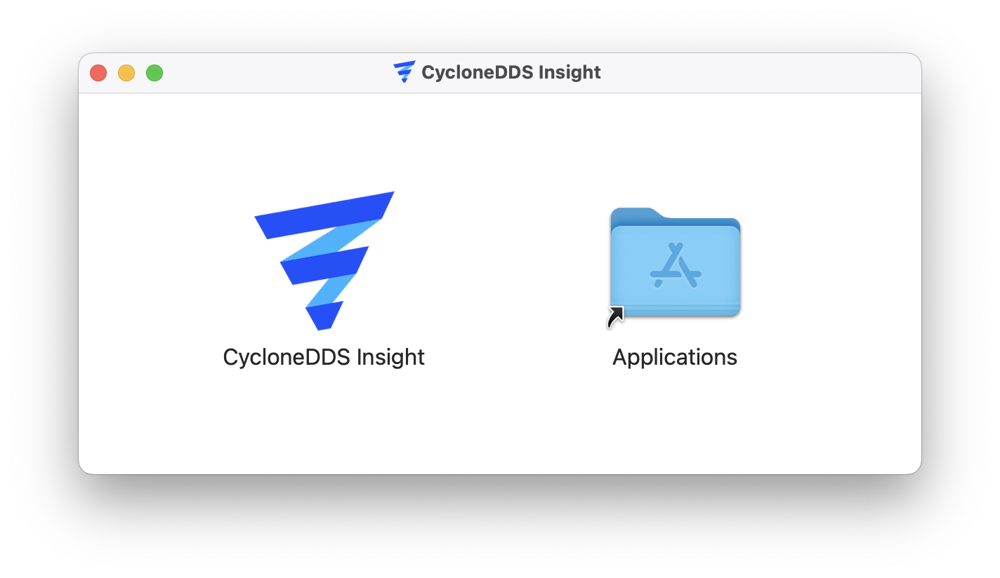
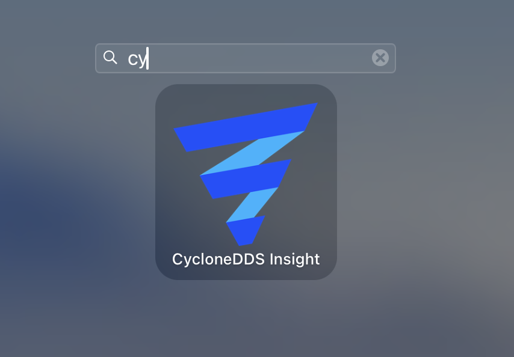

..
   Copyright(c) 2024 Sven Trittler

   This program and the accompanying materials are made available under the
   terms of the Eclipse Public License v. 2.0 which is available at
   http://www.eclipse.org/legal/epl-2.0, or the Eclipse Distribution License
   v. 1.0 which is available at
   http://www.eclipse.org/org/documents/edl-v10.php.

   SPDX-License-Identifier: EPL-2.0 OR BSD-3-Clause

MacOS Installation
==================

1. Download the |var-project| macOS artifact and move it to the Applications folder

2. Start the application via MacOS Finder or Launchpad

3. May you need to allow the application to run via System Preferences -> Security & Privacy due to macOS security policies
