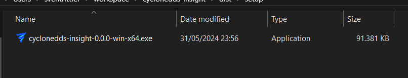
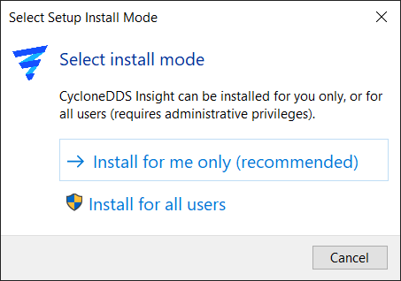
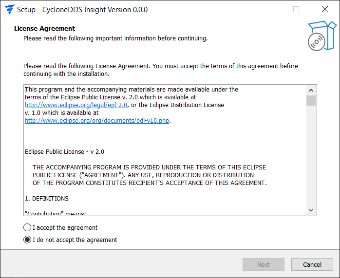
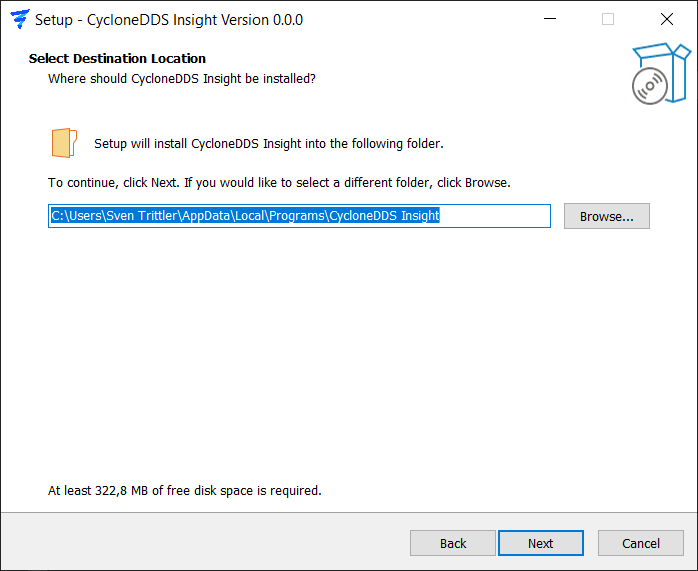
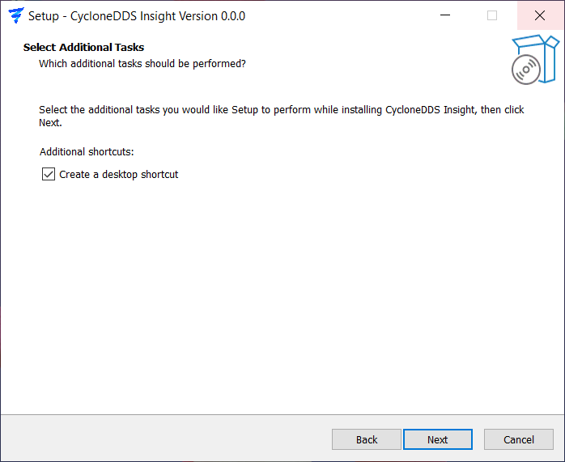
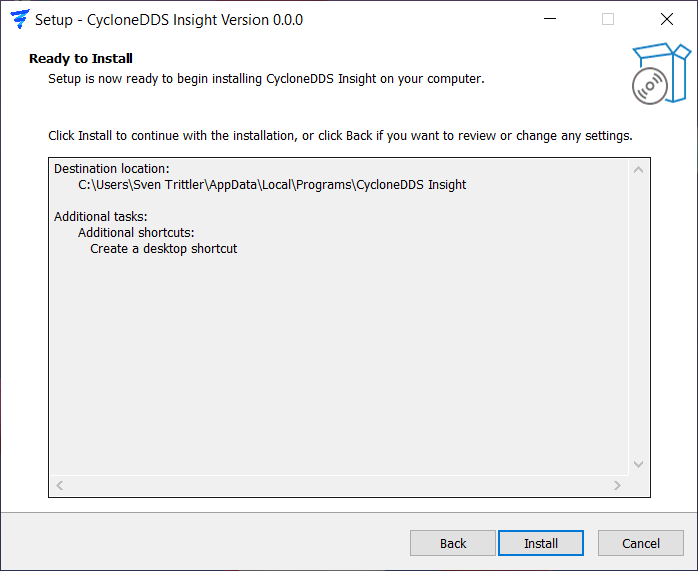
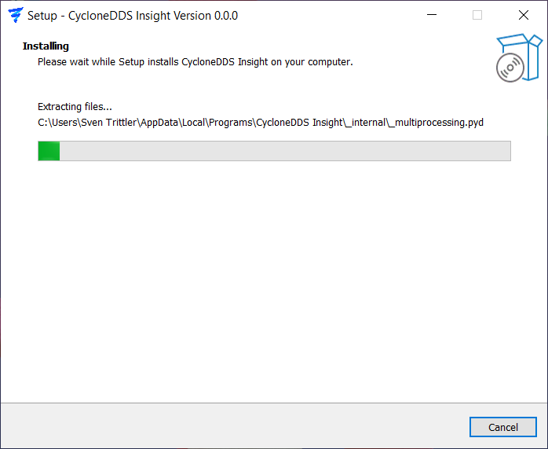
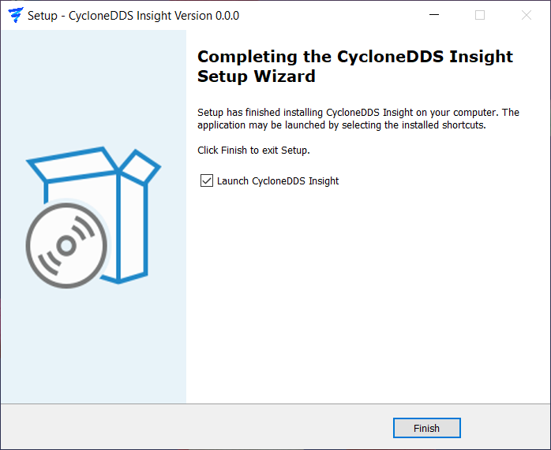
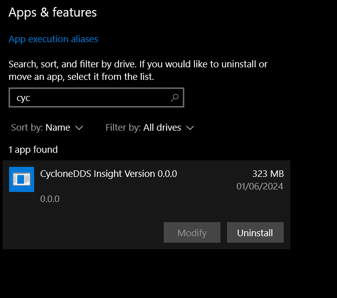

..
   Copyright(c) 2024 Sven Trittler

   This program and the accompanying materials are made available under the
   terms of the Eclipse Public License v. 2.0 which is available at
   http://www.eclipse.org/legal/epl-2.0, or the Eclipse Distribution License
   v. 1.0 which is available at
   http://www.eclipse.org/org/documents/edl-v10.php.

   SPDX-License-Identifier: EPL-2.0 OR BSD-3-Clause

Windows Installation
====================

1. Download the |var-project| Windows artifact and extract the zip file
2. Start Exe Installer File

3. Install as User or Admin

4. Agree License

5. Select Installation Folder

6. Ask Desktop shortcut creation

7. Confirm location and shortcut

8. Installing ...

9. Installation Complete - Launch App directly?

10. App is installed in Windows

11. After installation, you can launch |var-project| from the Start Menu or desktop shortcut
