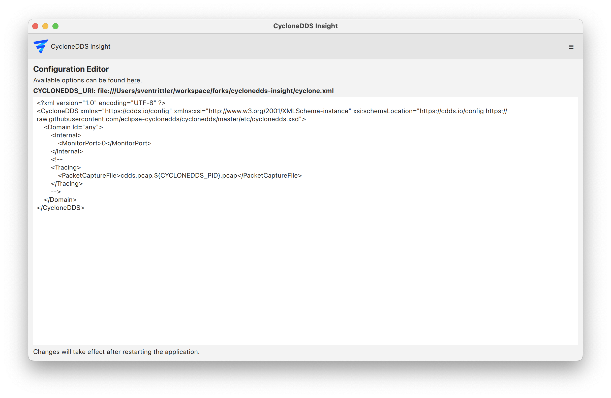

..
   Copyright(c) 2024 Sven Trittler

   This program and the accompanying materials are made available under the
   terms of the Eclipse Public License v. 2.0 which is available at
   http://www.eclipse.org/legal/epl-2.0, or the Eclipse Distribution License
   v. 1.0 which is available at
   http://www.eclipse.org/org/documents/edl-v10.php.

   SPDX-License-Identifier: EPL-2.0 OR BSD-3-Clause

Config Editor
=============

The configuration editor allows you to view and edit |var-core-project-short| xml configuration.

1. Navigate to "Menu" -> "Configuration Editor"
2. Create or edit the desired configuration in the text area
3. Changes are save automatically

