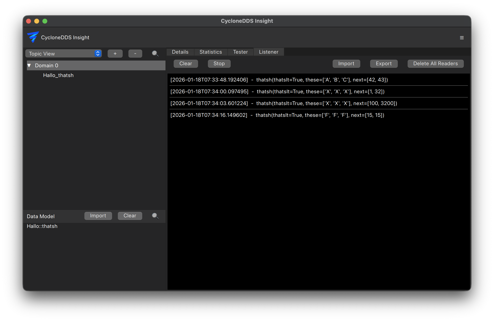

..
   Copyright(c) 2024 Sven Trittler

   This program and the accompanying materials are made available under the
   terms of the Eclipse Public License v. 2.0 which is available at
   http://www.eclipse.org/legal/epl-2.0, or the Eclipse Distribution License
   v. 1.0 which is available at
   http://www.eclipse.org/org/documents/edl-v10.php.

   SPDX-License-Identifier: EPL-2.0 OR BSD-3-Clause

Listener
========

The listener feature in |var-project| allows you to monitor and log specific events occurring within the DDS system.

General
-------

1. In the main view select the "Listener" tab
2. From the data model list on the left select the desired topic and create a reader
3. Monitor incoming data and events in real-time

Presets
-------

To quickly set up listeners for common scenarios, presets can be used to create multiple readers with predefined configurations.
Use the "Import" and "Export" buttons to share presets between different |var-project|.
