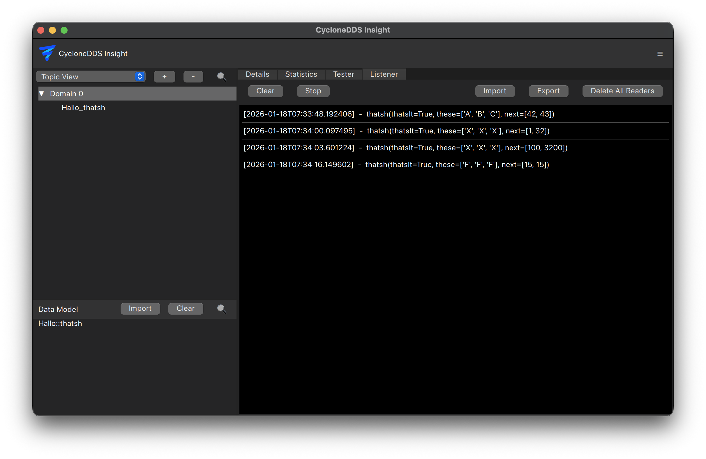

..
   Copyright(c) 2024 Sven Trittler

   This program and the accompanying materials are made available under the
   terms of the Eclipse Public License v. 2.0 which is available at
   http://www.eclipse.org/legal/epl-2.0, or the Eclipse Distribution License
   v. 1.0 which is available at
   http://www.eclipse.org/org/documents/edl-v10.php.

   SPDX-License-Identifier: EPL-2.0 OR BSD-3-Clause

Listener
========

The listener feature in |var-project| allows you to monitor and log specific events occurring within the DDS system.

General
-------

1. In the main view select the "Listener" tab
2. From the data model list on the left select the desired topic and create a reader
3. Monitor incoming data and events in real-time

Sample views
------------

Use the view selector next to "Clear" to switch between "Message log" (every
received sample) and "Latest per instance" (one row per DDS instance per reader).
In the instance view, samples with the same DDS key update the existing row,
including its timestamp and sample information. Topics without keys have one
instance per reader. Instance state notifications also update that row.

You can switch views at any time. The full message log continues to be retained
and is used for sample export; the instance view reduces displayed rows, not log
memory usage. "Clear" clears both views.

Searching messages
------------------

Enter text in the search field next to the view selector and press Enter to
filter message contents. Matching is case-insensitive and works in both views,
together with the reader selection. Incoming samples and instance updates are
checked against the applied search. Empty the field and press Enter to remove
the filter. Searching does not change the stored log or sample export.

Presets
-------

To quickly set up listeners for common scenarios, presets can be used to create multiple readers with predefined configurations.
Use the "Import" and "Export" buttons to share presets between different |var-project|.
