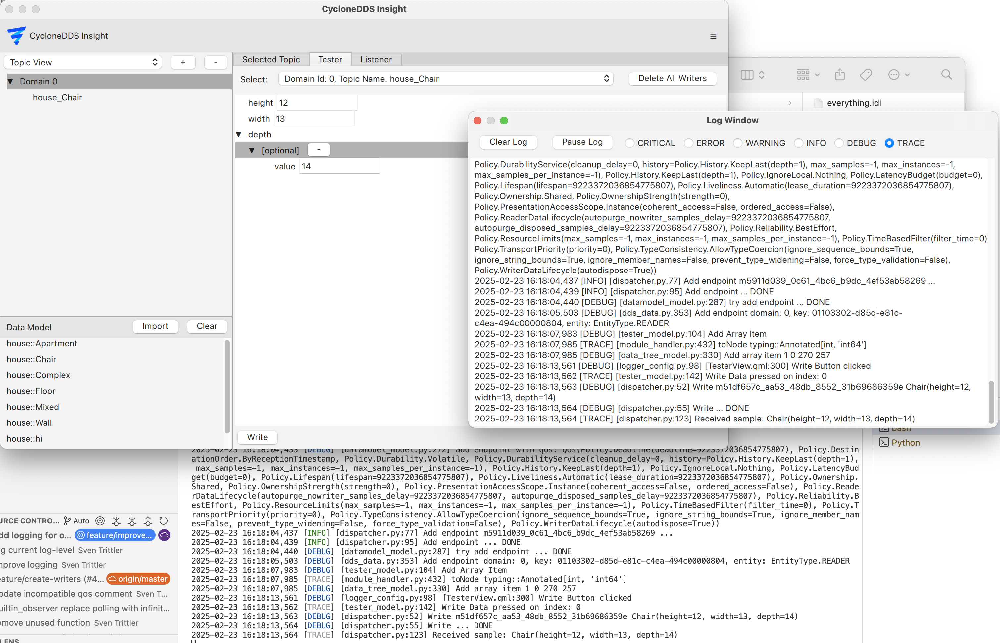

..
   Copyright(c) 2024 Sven Trittler

   This program and the accompanying materials are made available under the
   terms of the Eclipse Public License v. 2.0 which is available at
   http://www.eclipse.org/legal/epl-2.0, or the Eclipse Distribution License
   v. 1.0 which is available at
   http://www.eclipse.org/org/documents/edl-v10.php.

   SPDX-License-Identifier: EPL-2.0 OR BSD-3-Clause

Log Window
==========

The logs from |var-project| can be viewed in the log window.
This is useful for debugging issues or just to see what |var-project| is doing in the background.

1. Go to "Menu" -> "Log Window" to open the log window

