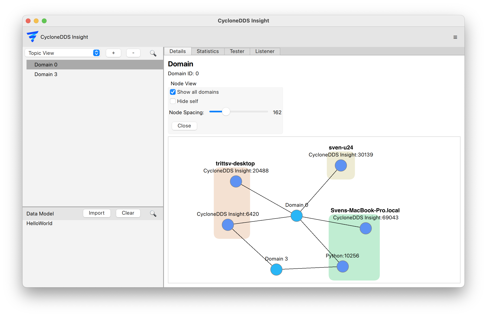

..
   Copyright(c) 2024 Sven Trittler

   This program and the accompanying materials are made available under the
   terms of the Eclipse Public License v. 2.0 which is available at
   http://www.eclipse.org/legal/epl-2.0, or the Eclipse Distribution License
   v. 1.0 which is available at
   http://www.eclipse.org/org/documents/edl-v10.php.

   SPDX-License-Identifier: EPL-2.0 OR BSD-3-Clause

Node View
=========

To get an overview of the current DDS system, the Node View is the main interface
it provides a high level overview of involved hosts, domains and applications.

1. Navigate to topic view on the left sidebar
2. Click on the desired domain
3. Click the "Details" tab in the main window
4. In the "Node View" section, click "Show"
    - Optionally enable "Show all domains" to visualize all domains at once
    - Optionally enable "Hide self" to hide the |var-project| application node
    - Optionally enable "Show Speeds" to visualize data flow speeds between nodes

