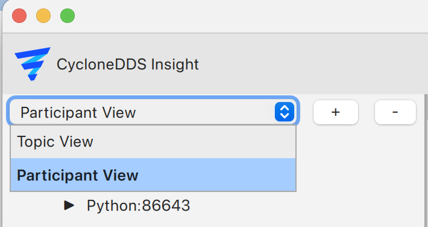
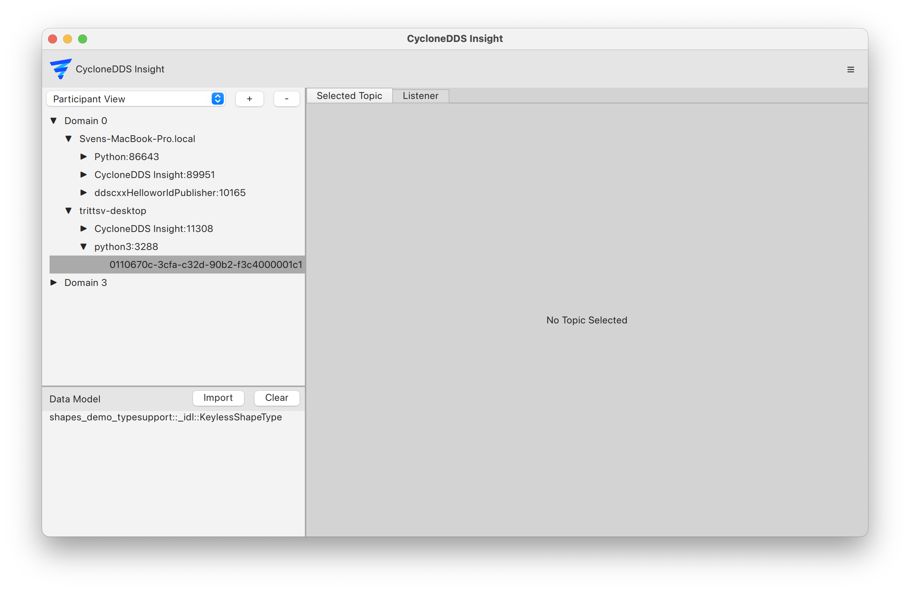

..
   Copyright(c) 2024 Sven Trittler

   This program and the accompanying materials are made available under the
   terms of the Eclipse Public License v. 2.0 which is available at
   http://www.eclipse.org/legal/epl-2.0, or the Eclipse Distribution License
   v. 1.0 which is available at
   http://www.eclipse.org/org/documents/edl-v10.php.

   SPDX-License-Identifier: EPL-2.0 OR BSD-3-Clause

Participant View
================

You can see participants and their related hostname, process-name and pid.
Tree organized by Domain/hostname/process:pid/participant-key.

1. Select participant view from the dropdown in the top left

2. Expand the tree to see the participants

