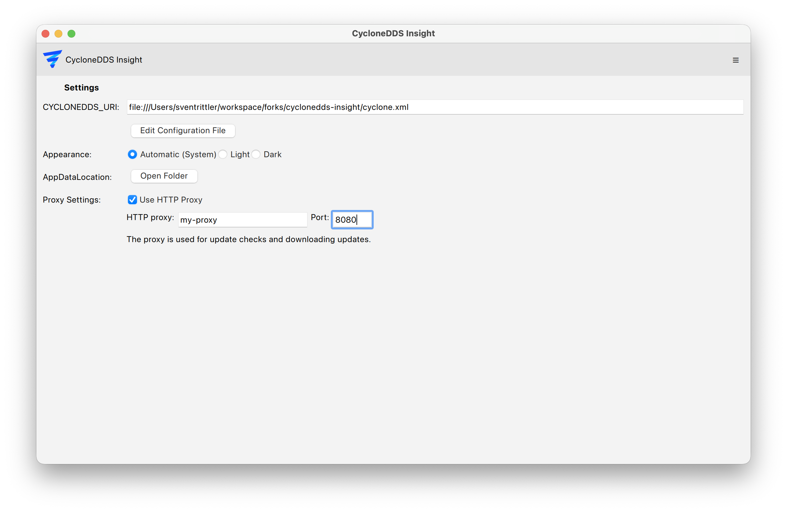
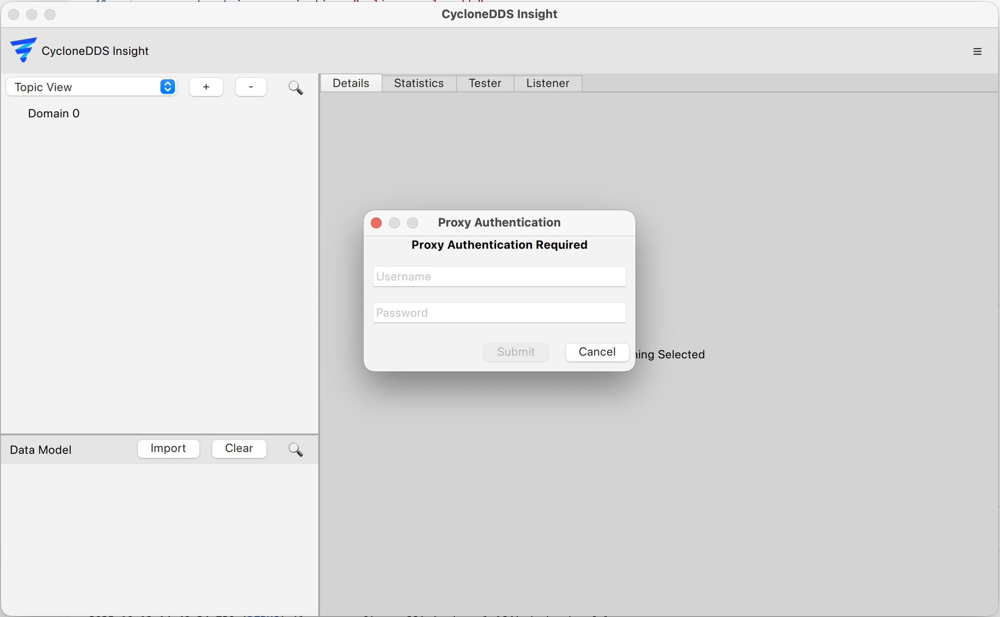

..
   Copyright(c) 2024 Sven Trittler

   This program and the accompanying materials are made available under the
   terms of the Eclipse Public License v. 2.0 which is available at
   http://www.eclipse.org/legal/epl-2.0, or the Eclipse Distribution License
   v. 1.0 which is available at
   http://www.eclipse.org/org/documents/edl-v10.php.

   SPDX-License-Identifier: EPL-2.0 OR BSD-3-Clause

Proxy Settings
==============

|var-project| supports automatic update checks and can download updates from
the internet. If you are behind a proxy server, you need to configure the proxy
settings in order for these features to work.

Configuring Proxy Settings
--------------------------

To configure the proxy settings, follow these steps:

1. Open |var-project|.
2. Go to the "Settings" menu.
3. Navigate to the "Proxy Settings" section.
4. Enter the following details:
    - **Enable**: Set checkbox to enable proxy usage.
    - **Proxy**: Enter the hostname or IP address of the proxy server.
    - **Port**: Enter the port number used by the proxy server.

5. Go to "Menu" -> "Check for updates"
6. Enter your proxy authentication details if prompted:
    - **Username**: Your proxy username.
    - **Password**: Your proxy password.

7. Press "Submit" and proceed with the update check.
Passwords are only stored in memory and are **never** saved to disk.
They need to be re-entered when restarting |var-project|.
