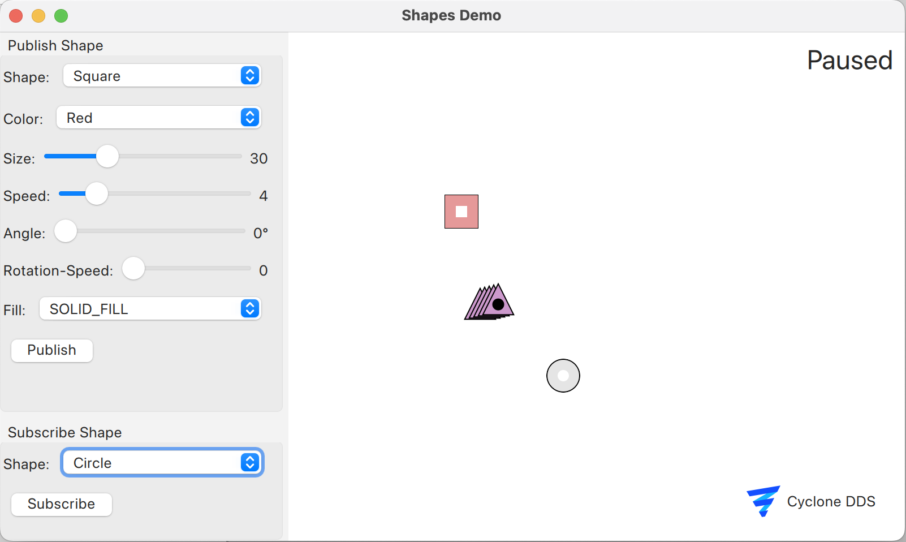
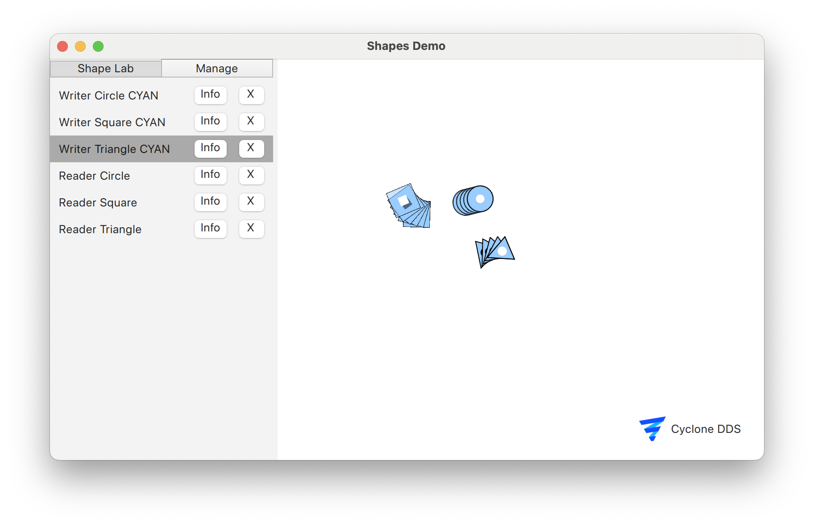

..
   Copyright(c) 2024 Sven Trittler

   This program and the accompanying materials are made available under the
   terms of the Eclipse Public License v. 2.0 which is available at
   http://www.eclipse.org/legal/epl-2.0, or the Eclipse Distribution License
   v. 1.0 which is available at
   http://www.eclipse.org/org/documents/edl-v10.php.

   SPDX-License-Identifier: EPL-2.0 OR BSD-3-Clause

Shapes Demo
===========

|var-project| includes a shapes demo application that visualizes various shapes being published over DDS.
This demo is a well known demo application for DDS implementations.

1. Go to "Menu" -> "Shapes Demo" to start the shapes demo window
2. Publish or subscribe to shapes using the buttons on the left

3. Manage the shapes using the "Manage Shapes" button

