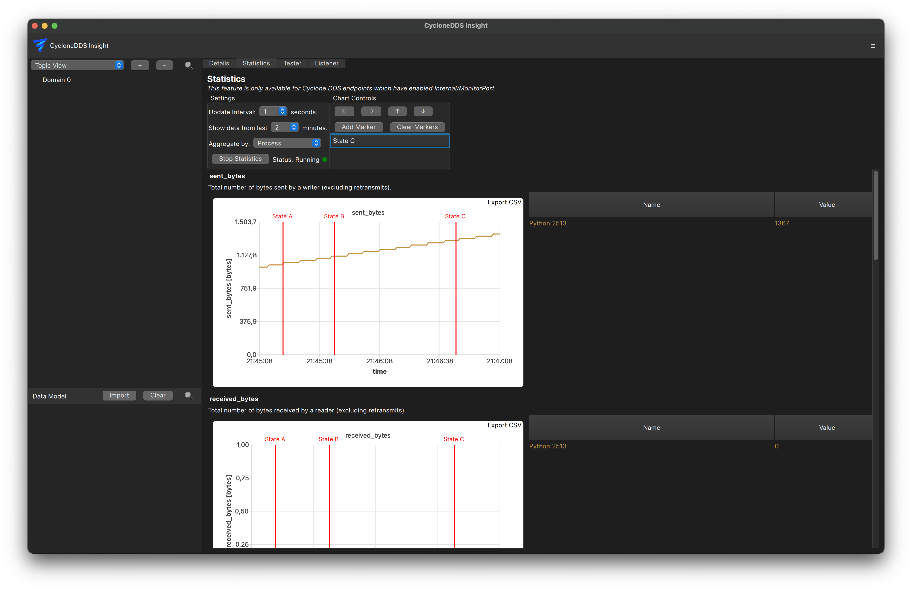

..
   Copyright(c) 2024 Sven Trittler

   This program and the accompanying materials are made available under the
   terms of the Eclipse Public License v. 2.0 which is available at
   http://www.eclipse.org/legal/epl-2.0, or the Eclipse Distribution License
   v. 1.0 which is available at
   http://www.eclipse.org/org/documents/edl-v10.php.

   SPDX-License-Identifier: EPL-2.0 OR BSD-3-Clause

Statistics
==========

|var-project-short| includes a integration with |var-core-project-short| statistics interface.
This allows you to view real-time statistics about the DDS system like

- Sent bytes
- Received bytes
- Retrasmitted bytes and total retransmissions
- Acknowledgements
- Total reliable readers
- and more...

This feature is specific to |var-core-project-short| and is not available for other DDS implementations.
All |var-core-project-short| based applications in the DDS system need to have statistics enabled to gather complete data.
To enable statistics in |var-core-project-short| applications, enable the "Internal/MonitorPort" in the XML configuration file of each application.

General
-------

1. Navigate to the "Statistics" tab in the main view
2. Adjust update interval
3. Enter the desired aggregation filter (e.g., domain, host, application, ...)
4. "Start Statistics"

