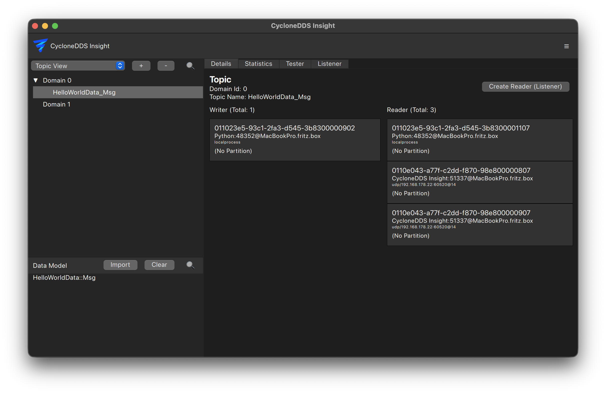

..
   Copyright(c) 2024 Sven Trittler

   This program and the accompanying materials are made available under the
   terms of the Eclipse Public License v. 2.0 which is available at
   http://www.eclipse.org/legal/epl-2.0, or the Eclipse Distribution License
   v. 1.0 which is available at
   http://www.eclipse.org/org/documents/edl-v10.php.

   SPDX-License-Identifier: EPL-2.0 OR BSD-3-Clause

Topic View
==========

This view is the default view when starting |var-project|, it shows all discovered DDS Topics in the sidebar on the left side.
By selecting a Topic, the main area under "details" shows information about the selected Topic, including topic name, type, publishers, subscribers, partitions.
When you hover or click on a datareader or datawriter, additional information about the selected entity is shown like QoS settings.

